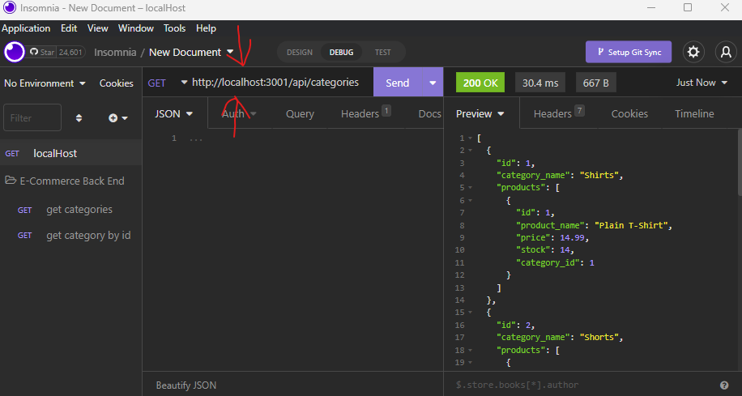
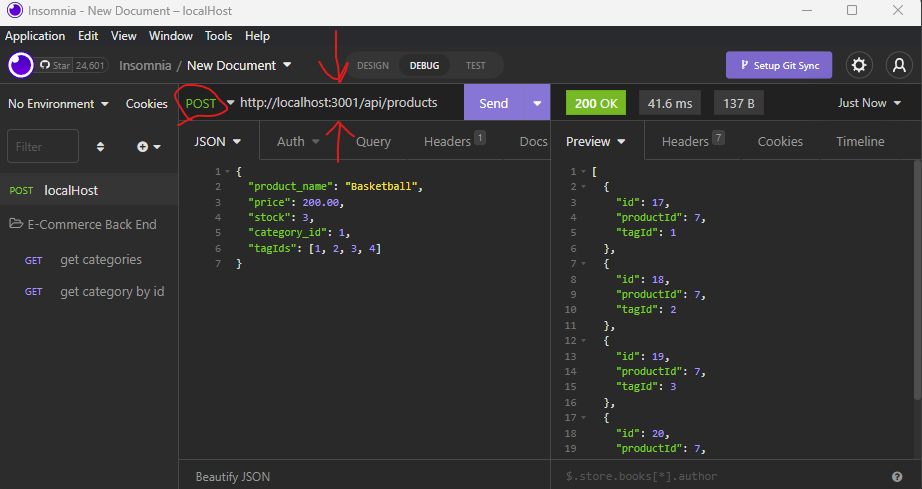
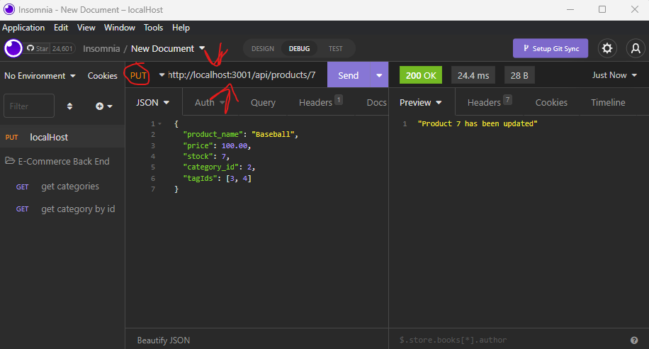
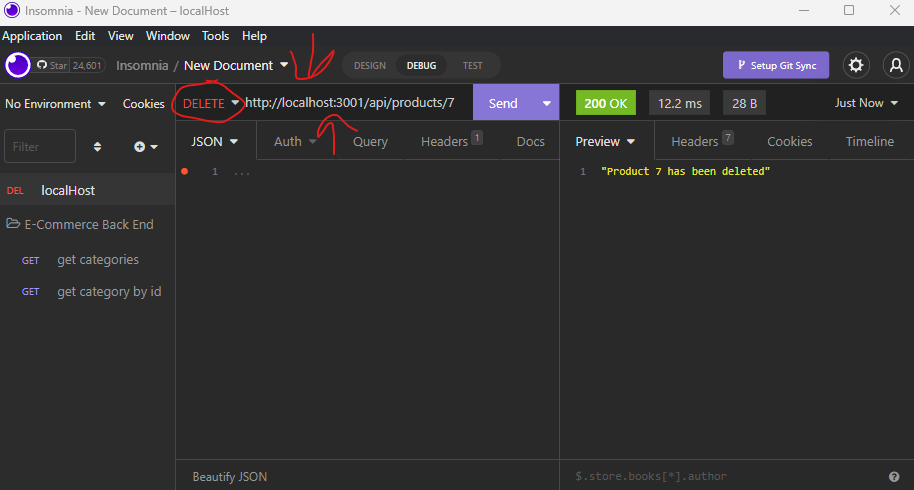

<p id="readme-top"></p>

[](./LICENSE) [](https://www.linkedin.com/in/mateo-wallace/)

# M13 - E-Commerce Back End

## Description

E-Commerce Backend is a server database that allows the user to make get, post, put, and delete requests in order to fully manipulate data. It was made in order to practice ORM and Sequelize.

While building this project I learned to:
- Do full CRUD on a database through JavaScript alone
- Create tables that relate to each other using models
- Link get, pull, put, and delete requests to mySQL create, read, update, destroy

### Built With

[](https://sequelize.org/) [](http://expressjs.com/) [](https://www.mysql.com/) [](https://docs.insomnia.rest/) [](https://developer.mozilla.org/en-US/docs/Web/JavaScript) [](https://nodejs.org/en/)

## Table of Contents
- [Installation](#installation)
- [Usage](#usage)
    - [Get Requests](#get-requests)
    - [Post Requests](#post-requests)
    - [Put Requests](#put-requests)
    - [Delete Requests](#delete-requests)
    - [Video Walkthrough](#video-walkthrough)
- [License](#license)
- [Contact](#contact)

## Installation

1. Clone the repo down to your local machine.
2. If you don't have Node.js, navigate to [nodejs.org](https://nodejs.org/en/) & download v16.18.0 or newer.
3. If you don't have DBeaver, navigate to [dbeaver.io](https://dbeaver.io/download/) & download DBeaver Community 22.2.4 or newer.
4. If you don't have Insomnia, navigate to [insomnia.rest](https://insomnia.rest/download) & download Insomnia.
5. Open the directory in your terminal and run `npm i` .
6. Navigate to the `db` folder. Open the `schema.sql` file. Copy and Paste it's contents into DBeaver and run the file.
7. Seed the database from the command line by running `npm run seed`

For an example of the application at work see the [Video Walkthrough](#video-walkthrough)

<p align="right">(<a href="#readme-top">back to top</a>)</p>

## Usage

Open your terminal, and in the command line run 

	npm start

This should make your server begin listening for requests. Navigate to Insomnia and in the navigation bar type in any of these requests in order to manipulate your database:

### Get Requests

Get requests are used to view information. The following commands will show you ALL data of a specific type.

- `http://localhost:3001/api/tags` to view all tags
- `http://localhost:3001/api/products` to view all products
- `http://localhost:3001/api/categories` to view all categories

These commands will give you data of a specified ID. Edit the `:id` in the link to the id of the item you would like to view.

- `http://localhost:3001/api/tags/:id` to view a specific tag
- `http://localhost:3001/api/products/:id` to view a specific product
- `http://localhost:3001/api/categories/:id` to view a specific category



### Post Requests

Post requests are used to add new information. The following commands will Post data to a specific type.

- `http://localhost:3001/api/tags` to post to tags
    - Example body input
        ```
        {
            "tag_name": "round"
        }
        ```
- `http://localhost:3001/api/products` to post to products
    - Example body input
        ```
        {
            "product_name": "Basketball",
            "price": 200.00,
            "stock": 3,
            "category_id": 1,
            "tagIds": [1, 2, 3, 4]
        }
        ```
- `http://localhost:3001/api/categories` to post to categories
    - Example body input
        ```
        {
            "category_name": "Joggers"
        }
        ```



### Put Requests

Put requests are used to update information. The following commands will Put data to a specific item in a specific type. Edit the `:id` in the link to the id of the item you would like to update.

- `http://localhost:3001/api/tags/:id` to put to a tag
    - Example body input
        ```
        {
            "tag_name": "triangular"
        }
        ```
- `http://localhost:3001/api/products/:id` to put to a product
    - Example body input
        ```
        {
            "product_name": "Baseball",
            "price": 100.00,
            "stock": 7,
            "category_id": 2,
            "tagIds": [3, 4]
        }
        ```
- `http://localhost:3001/api/categories/:id` to put to a category
    - Example body input
        ```
        {
            "category_name": "Runners"
        }
        ```



### Delete Requests

Pelete requests are used to destroy information. The following commands will Delete a specific item. Edit the `:id` in the link to the id of the item you would like to delete.

- `http://localhost:3001/api/tags/:id` to delete a tag
- `http://localhost:3001/api/products/:id` to delete a product
- `http://localhost:3001/api/categories/:id` to delete a category



### Video Walkthrough

For an example of the application at work see the:
- Video: [drive.google.com](https://drive.google.com/file/d/1RQSaV9QSJ09SR8rHoH3KX4f07NLsIxql/view)
<p align="right">(<a href="#readme-top">back to top</a>)</p>

## License

Distributed under the MIT License. See [LICENSE](./LICENSE) for more information.
<p align="right">(<a href="#readme-top">back to top</a>)</p>

## Contact

For any further questions feel free to contact me via:
- GitHub: [Mateo-Wallace](https://github.com/Mateo-Wallace)
- Email: [mateo.t.wallace@gmail.com](mailto:mateo.t.wallace@gmail.com)
- LinkedIn: [Mateo Wallace](https://www.linkedin.com/in/mateo-wallace-57931b254/)
<p align="right">(<a href="#readme-top">back to top</a>)</p>